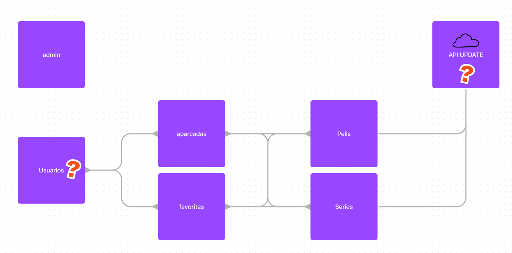

# Two-Days-BD

## Endpoints

### Auth Endpoints

| METHOD | ENDPOINT     | TOKEN | ROLE | DESCRIPTION           | POST PARAMS                                                                           | RETURNS |
| ------ | ------------ | ----- | ---- | --------------------- | ------------------------------------------------------------------------------------- | ------- |
| POST   | /auth/signup | -     | -    | User Sign Up          | user_name, user_nickname, image_url, email, date_of_birth, password, confirm_password | token   |
| POST   | /auth/login  | -     | -    | Delete skills from DB | email, password                                                                       | token   |

### Users Endpoints

| METHOD | ENDPOINT                                  | TOKEN | ROLE  | DESCRIPTION                    | POST PARAMS       | RETURNS              |
| ------ | ----------------------------------------- | ----- | ----- | ------------------------------ | ----------------- | -------------------- |
| GET    | /users                                    | YES   | All   | Get all users                  | -                 | [{ users }]          |
| GET    | /users/:userId                            | YES   | All   | Get one user                   | user_id           | { user }             |
| PUT    | /users/:userId                            | YES   | Admin | Update user                    | user_id           | "User updated"       |
| DELETE | /users/:userId                            | YES   | Admin | Remove one user                | user_id           | "Profile deleted"    |
| GET    | /users/:userId/preferences                | YES   | All   | Get user preferences           | user_id           | [{user.preferences}] |
| POST   | /users/:userId/preferences/serie/:serieId | YES   | All   | Add user select to preferences | user_id, serie_id | [{user.preferences}] |
| POST   | /users/:userId/preferences/movie/:movieId | YES   | All   | Add user select to preferences | user_id, movie_id | [{user.preferences}] |

### Movie Endpoints

| METHOD | ENDPOINT         | TOKEN | ROLE  | DESCRIPTION      | POST PARAMS | RETURNS         |
| ------ | ---------------- | ----- | ----- | ---------------- | ----------- | --------------- |
| GET    | /movies          | YES   | All   | Get all movies   | -           | [{ movie }]     |
| GET    | /movies/:movieId | YES   | All   | Get one movie    | movie_id    | { movie }       |
| PUT    | /movies/:movieId | YES   | Admin | Update movie     | movie_id    | "Movie updated" |
| DELETE | /movies/:movieId | YES   | Admin | Remove one movie | movie_id    | "Movie deleted" |
| GET  | /movie/newRandom?genres='usergenres' | YES   | All | Get random movie| movie_id    | { movie }  |

### Serie Endpoints

| METHOD | ENDPOINT          | TOKEN | ROLE  | DESCRIPTION      | POST PARAMS | RETURNS         |
| ------ | ----------------- | ----- | ----- | ---------------- | ----------- | --------------- |
| GET    | /series           | YES   | All   | Get all serie    | -           | [{ series }]    |
| GET    | /series/:serieId  | YES   | All   | Get one serie    | serie_id    | { serie }       |
| PUT    | /series/:seriesId | YES   | Admin | Update serie     | serie_id    | "Serie updated" |
| DELETE | /series/:serieId  | YES   | Admin | Remove one serie | serie_id    | "Serie deleted" |
| GET  | /serie/newRandom?genres='usergenres' | YES   | All | Get random serie | serie_id    | { serie }  |

## Analisis

- Punto de vista usuario.

- Punto de vista administrador

- Tocar menos de 3 botones?

- Si hay descuadre/rechazo de capítulo => reset y rehacer

- Solo sugerencias de seguimientos

- Modo maratón/tele

- Qué veo? => sugerencias limitadas => rechazo de todas => salir.

- Dónde está la serie/película A la hora de registrarse => preguntas por gustos => swipping por opciones

---

Problema :

`Perdemos mucho tiempo buscando qué ver y dónde verlo, nos gustaría simplificar las cosas para que el poco tiempo del que disponemos sea disfrutando sin tener que estar eligiendo.`

---

### Estructura DB

#### Provisional

---
### User flow

User flow: 

-User runs app.

-User REGISTER:

-User inputs data.
-Category questions are shown.
-User selects.
-'How many time question' is shown.
-User selects.
*Time is less than two hours?
-Show suggestions until user accepts.
*Time is more than two hours?
-Movie or show question is shown.
-User selects.
-Random in base of category previously selected.

-USER LOGIN:

-User inputs data.
-'How many time question' is shown.
  -Less than two hours?
	*Less than 4 and more than 1 pending?
 	  · 'Would you like to see new' question is shown.
 		-If yes: random suggestion in base of user/category until user accepts.
 		-If not: show user pending suggestions.
 		  -If user doesnt accept anyone: EXIT.
  -More than two hours?
	*'Show or movie' question is shown.
	-User selects movie.
	-(there wont be pending movies) User will be shown 8 random movies.
	-If user doesnt accept anyone
	    · 'Would you like better to watch a show?' question is shown.
      
	      -If yes: random suggestion in base of user/category until user accepts.
	        If not: EXIT.
      		
	-User selects show.
		*Less than 4 and more than 1 pending?
 	    · 'Would you like to see new' question is shown.
 		-If yes: random suggestion in base of user/category until user accepts.
 		-If not: show user pending suggestions.
 			-If user doesnt accept any of suggestions.
 			     -'Would you like to see a movie' question is shown.
 		  		-If no. EXIT.
 		  		-If yes. User will be shown up until 8 random movies.
 		  			-If user doesnt accept anyone: EXIT.

---

[Figma](https://www.figma.com/file/6HmxlxnO5guiVslbWCFAz8/Untitled?node-id=0%3A1&t=YbxGSBsvTRDIlvJs-1)

## NPM I

- npm i -y
- npm i nodemon
- npm i express
- npm i morgan
- npm i dotenv
- npm i sequelize
- npm i mysql2
- npm i bcrypt
- npm i jsonwebtoken

---

## Tecnologias

---

## User avatars

